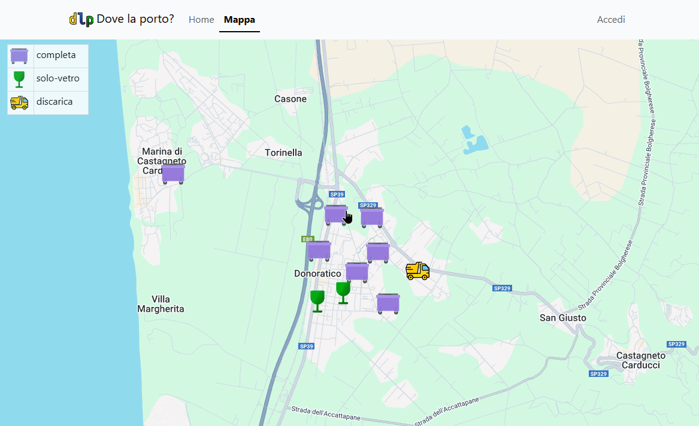
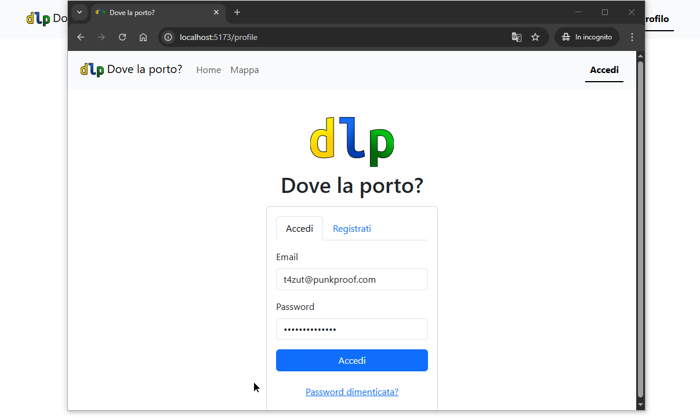
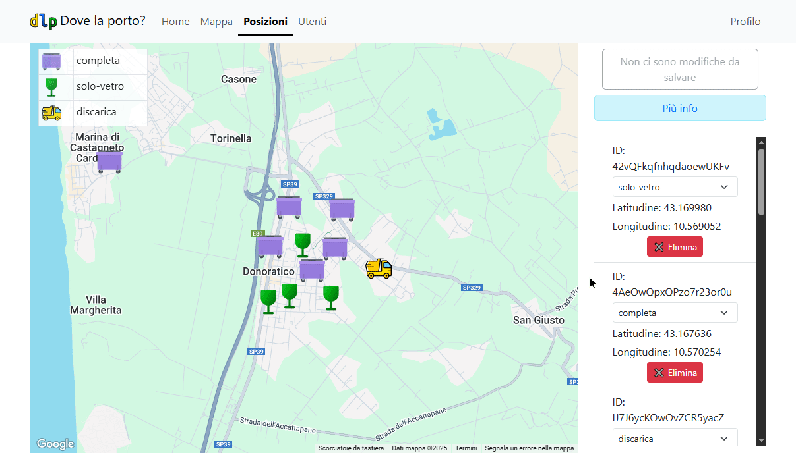

# dove-la-porto

Dove la porto? è un'applicazione che consente di visualizzare in tempo reale le postazioni dei cassonetti nella zona.

## Funzionalità

- Gli utenti non registrati possono visualizzare la mappa e ricevere notifiche quando le posizioni vengono modificate
- Autenticazione basata su Firebase con email e password
- Ruoli di operatore e amministratore impostabili per gli utenti
- Modifica delle posizioni integrata con Google Maps
- Sia operatori che amministratori possono modificare le posizioni sulla mappa
- Solo gli amministratori possono impostare o revocare i ruoli agli altri utenti

## Screenshots
#### Visualizzare la mappa


#### Modificare gli utenti


#### Modificare le posizioni



## Installazione

### Requisiti
- **node** v22.11.0 (LTS) con **npm**

### Firebase
1. Creare il progetto ed acquisire la chiave ed i parametri per utilizzarlo su Web API. Tali dati sono da inserire nel file `.env` del client (vedi sotto).
2. Abilitare l'API Authentication tramite Email
3. Acquisire la chiave per Firebase Admin da mettere nel server (`firebase-adminsdk-pkey.json` vedi sotto). Progetto > Impostazioni progetto > Account di servizio > SDK Firebase Admin > Node.js > Genera nuova chiave privata

### Google Maps
1. Abilitare le API di Google Maps: Google Cloud Console > scegliere il progetto creato con Firebase > Api e servizi > Libreria > Maps JavaScript API > Abilita. \
  La chiave che viene restituita è da inserire nel file `.env` del client (vedi sotto).
2. Creazione stile mappa: Google Cloud Console > scegliere il progetto creato con Firebase > Menu a sinistra > Google Maps Platform > Stili mappa > Crea stile > Chiaro > Personalizza > Punto d'interesse > Cliccare due volte sull'occhio per disabilitarlo, sia su Poligono che su Etichetta > Salva
3. Creazione ID mappa: Sempre sulla sinistra > Gestione mappa > Crea ID mappa > mettere un nome e scegliere tipo Javascript > Salva > Aprire la mappa appena creata > in basso su Chiaro premere Cambia stile > Scegliere lo stile creato al passo precedente
4. Nella stessa pagina c'è l'ID mappa che va messo nel file `.env` del client (vedi sotto)

### Download
1. `git clone https://github.com/Biagio00/dove-la-porto.git`
2. `cd ./dove-la-porto`

### Client
1. `cd ./dlp-frontend`
2. `npm install`
3. In questa cartella inserire il file `.env` con le API di Google Maps e di Firebase impostando le seguenti variabili d'ambiente:
```
VITE_GOOGLE_MAPS_API_KEY=
VITE_GOOGLE_MAPS_MAP_ID=
VITE_FIREBASE_API_KEY=
VITE_FIREBASE_AUTH_DOMAIN=
VITE_FIREBASE_PROJECT_ID=
VITE_FIREBASE_STORAGE_BUCKET=
VITE_FIREBASE_MESSAGING_SENDER_ID=
VITE_FIREBASE_APP_ID=
```
4. `npm run dev` -> deve ascoltare su http://localhost:5173/ altrimenti non funziona il CORS

### Server
1. `cd ./dlp-backend`
2. `npm install`
3. In questa cartella inserire il file `firebase-adminsdk-pkey.json` ottenuto creando una nuova chiave per Firebase Admin
4. `npm run startsx` (ci mette un po' a partire) deve ascoltare sulla porta 3000 altrimenti il client non lo raggiunge


### Credenziali utenti di test

- amministratore -> t4zut@punkproof.com:Testing.123456
- operatore -> wodigoj236@iridales.com:Testing.123456


